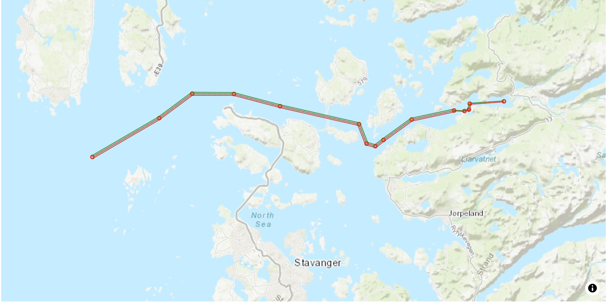
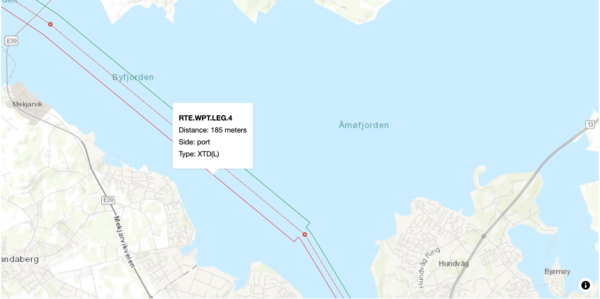
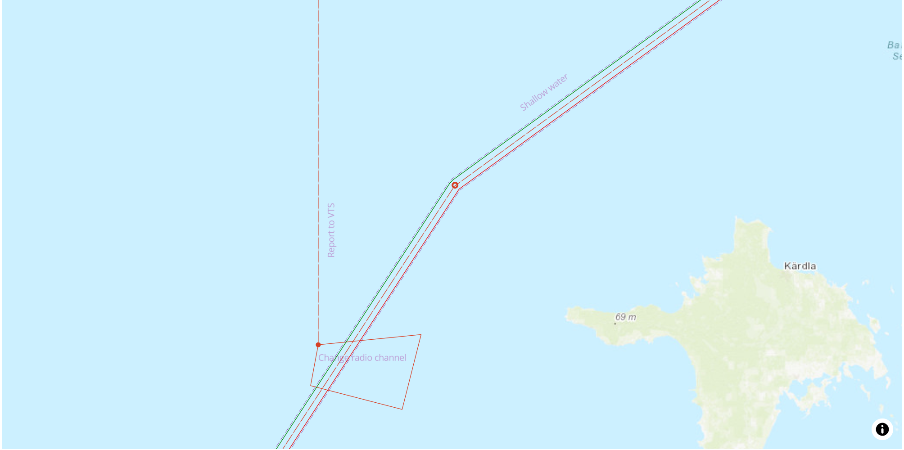

# Maritime Route Portrayal
Javascript library for client-side parsing and portrayal rendering of RTZ and S-421 route data for maplibre and leaflet. XML data in RTZ or S412 format can be passed to either ```S421toGeoJSON()``` or ```RTZtoGeoJSON()```. The output is a GeoJSON feature collection that holds all the source elements to create RouteWaypoints, RouteWaypointLegs and RouteActionPoints. A third method ```createLayers()``` takes sourceName as a mandatory parameter and layerIdPrefix as an optional parameter. The method will return layers with portrayal rules to match with the GeoJSON source. The portrayal rules follow the S421 portrayal catalogue found on [this link](https://www.cirm.org/s-421/index.html).

As an extra feature, XTD(L) lines and CL lines are displayed if the data is present. This repository showcases the use of the library on a simulated client-side application.


## Project Structure
### \_\_tests\_\_
The test folder contains all the test files.

### client
This folder works as an example showcasing how a client-side application can use the javascript library to render routes on a maplibre map. The client folder is completely separate from the rest of the project, to simulate a client-side application. The only connection is the import of the ESM library modules from the **dist** folder. Both RTZ and S421 routes are parsed and displayed.

### data
The **data** folder contains data assets such as JSON data that is used in the source code. In this project the data folder only contains a file with data to be used during the tests.

### dist
This folder is automatically generated by running the webpack bundle script. The folder conatins the bundeled version of the javascript library. ```routePortrayal.min.js``` works with CommonJS and in browsers. ```routePortrayal.esm.js``` should be used with ECMA Script modules.

### images
A folder only containing images used in the readme.

### SampleFiles
This folder is dividied into two subfolders, **RTZ** and **S421**. Each of them contain sample files in RTZ and S421 format respectively.

### src
The **src** folder contains the javascript source code that made up the library. The folder has 3 subfolders; **models**, **RTZ** and **S421**. The RTZ and S421 folders contain source code that parses the xml into the Javascript models declared in the **models** subfolder. There are files in the **src** folder, in addition to the subfolders. These files use the parsed Javascript models to create a GeoJSON output for the route. Additionally, **layers.js** contains a method ```createLayers()``` that will return layers with appropriate styling according the S421 portrayal catalogue.


## Installation and Use
To use the library, navigate to the dist folder. In this fodler there are two bundeled versions of the library. ```routePortrayal.min.js``` works in the browser and for CommonJS. With ECMA Script modules, ```routePortrayal.esm.js``` should be used. More information of how to import the library are presented below.

### Browser
Clone the repository and move the file to the application where it should be used. In the HTML file of the client, load the script as a normal Javascript script. ```<script src="<path to file>/routePortrayal.min.js"></script>```. The follwing three methods become accessible: 
- ```routePortrayal.S421ToGeoJSON(xml)```
- ```routePortrayal.RTZtoGeoJSON(xml)```
- ```routePortrayal.createLayers(sourceName,idPrefix[optional])```

### CommonJS
To use the library with CommonJS syntax in Node, include the following line in the code:
```const routePortrayal = require('<path to file>/routePortrayal.min.js');```. The same three methods as above become accessible.

### ES modules
To include the library in an ES6 module, ```routePortrayal.esm.js``` should be used. Include this line in the code to import the three methods from the library: ```import { S412toGeoJSON, RTZtoGeoJSON, createLayers } from '<path to file>/routePortrayal.esm.js';```. The three methods are now accessible without the the library name in front. 


### Local Development
For local development on the project, follow these steps.
- Clone repository
- Install all modules by running: ```npm i```.
- To run one of the files in Node, type ```node <name of file>.js```
- To create a new bundled Javascript file type ```npx webpack --config webpack.config.cjs```. This will create a new file in the **dist** directory.

## Testing
The test files are located in the **\_\_test\_\_** folder. To run the tests locally, make sure the all node modules are install by running the command ```npm i```. To run all test files at once, type ```npm test```. To only run tests for a single file, type ```npm test __tests__/<name of file>```. To chech the coverage of the testing, type ```npm test -- --coverage```. This will create a folder called **coverage**. Navigate into the subfolder inside the **coverage** directory and open the ```index.html``` in a browser to display the coverage of the tests.


## Route Examples






## Requirements
- Node.js - for local development
